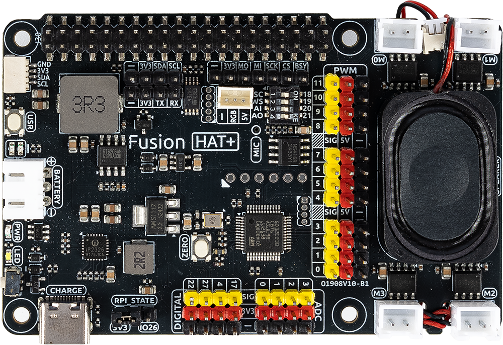

 .. note::

    Hello, welcome to the SunFounder Raspberry Pi & Arduino & ESP32 Enthusiasts Community on Facebook! Dive deeper into Raspberry Pi, Arduino, and ESP32 with fellow enthusiasts.

    **Why Join?**

    - **Expert Support**: Solve post-sale issues and technical challenges with help from our community and team.
    - **Learn & Share**: Exchange tips and tutorials to enhance your skills.
    - **Exclusive Previews**: Get early access to new product announcements and sneak peeks.
    - **Special Discounts**: Enjoy exclusive discounts on our newest products.
    - **Festive Promotions and Giveaways**: Take part in giveaways and holiday promotions.

    👉 Ready to explore and create with us? Click [|link_sf_facebook|] and join today!

Hardware
=====================================

   

The Fusion HAT+ is a powerful and versatile expansion board designed to effortlessly transform a Raspberry Pi into a fully functional robot with minimal setup, and it can also support advanced automation projects. 

At the heart of the Fusion HAT+ is an onboard microcontroller (MCU), which significantly extends the Raspberry Pi’s native functionality by providing additional PWM outputs and ADC inputs—capabilities that are typically absent on standard Raspberry Pi models. This allows developers to achieve more precise motor control and sensor integration.

Compact in size yet rich in functionality, the Fusion HAT+ integrates four motor driver chips, supporting independent control of up to four DC motors. It also features a digital I2S audio module and a built-in mono speaker, enabling high-quality audio playback and interactive sound features directly from the board.

The board accepts a 6.0V to 8.4V power input via a 3-pin XH2.54 connector. It includes two power indicator LEDs for monitoring system status, a user-programmable LED for custom signaling, and a convenient onboard buttons for immediate function testing or input simulation—making development and debugging more efficient and user-friendly.

.. toctree::
    :maxdepth: 3

    features
    interfaces
    onboard_mcu
    battery

