 .. note::

    Hello, welcome to the SunFounder Raspberry Pi & Arduino & ESP32 Enthusiasts Community on Facebook! Dive deeper into Raspberry Pi, Arduino, and ESP32 with fellow enthusiasts.

    **Why Join?**

    - **Expert Support**: Solve post-sale issues and technical challenges with help from our community and team.
    - **Learn & Share**: Exchange tips and tutorials to enhance your skills.
    - **Exclusive Previews**: Get early access to new product announcements and sneak peeks.
    - **Special Discounts**: Enjoy exclusive discounts on our newest products.
    - **Festive Promotions and Giveaways**: Take part in giveaways and holiday promotions.

    👉 Ready to explore and create with us? Click [|link_sf_facebook|] and join today!

Interfaces
=========================

Pinout
---------------

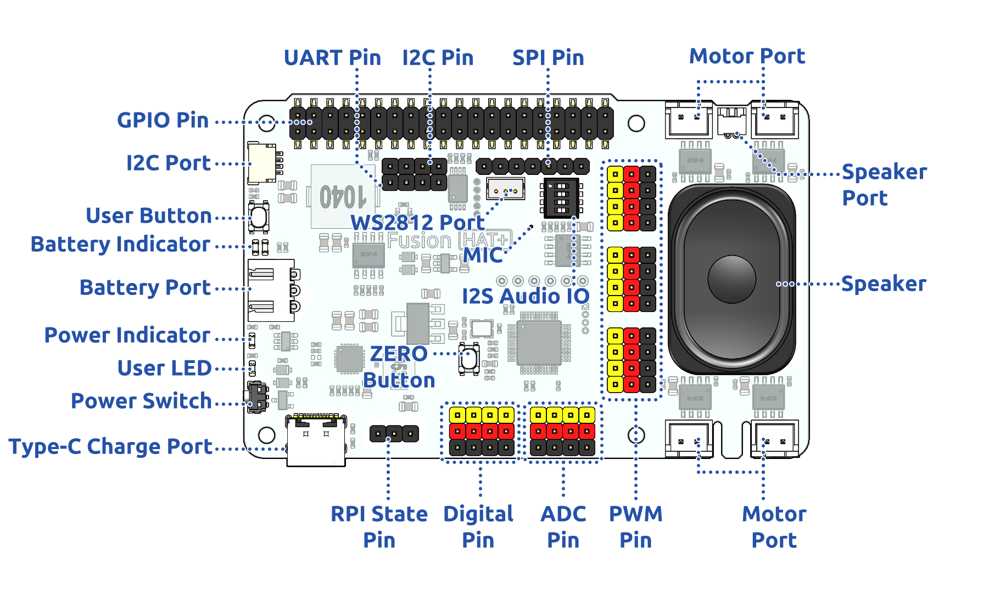

**Battery Port**
    * 6.0V-8.4V XH2.54 3pin power input.
    * Powering the Raspberry Pi and Fusion HAT+ at the same time.

**Power Switch**
    * Turn on/off the power of the Fusion HAT+.

**Type-C Charging Port**
    * Insert the Type-C cable to charge the battery.
    * During charging, the corresponding battery indicator light will flash.
    * It takes approximately 2 hours to fully charge. Once fully charged, if the Fusion HAT is powered on, both battery indicator lights will stay on continuously. If the Fusion HAT is powered off, both battery indicator lights will turn off.

**Digital Pin**
    * 4-channel digital pins, 17, 4, 27, 22.
    * Pin: :ref:`fh_pin_v0_digital`.
    * API: :class:`fusion_hat.pin.Pin`.

**ADC Pin**
    * 4-channel ADC pins, A0-A3.
    * Pin: :ref:`fh_pin_v0_adc`.
    * API: :class:`fusion_hat.adc.ADC`.

**PWM Pin**
    * 12-channel PWM pins, P0-P11.
    * Pin: :ref:`fh_pin_v0_pwm`.
    * API: :class:`fusion_hat.pwm.PWM`.

**Motor Port**
    * 4-channel XH2.54 motor ports.
    * Pin: :ref:`fh_pin_v0_motor`.
    * API: :class:`fusion_hat.motor.Motor`.

**I2C Pin and I2C Port**
    * **I2C Pin**: P2.54 4-pin interface.
    * **I2C Port**: SH1.0 4-pin interface, which is compatible with QWIIC and STEMMA QT. 
    * These I2C interfaces are connected to the Raspberry Pi's I2C interface via GPIO2 (SDA) and GPIO3 (SCL).
    * Pin: :ref:`fh_pin_v0_i2c`.
    * API: :class:`fusion_hat._i2c.I2C`.

**SPI Pin**
    * P2.54 7-pin SPI interface.
    * Pin: :ref:`fh_pin_v0_spi`.

**UART Pin**
    * P2.54 4-pin interface.
    * Pin: :ref:`fh_pin_v0_uart`.

**WS2812 Port**
    * 1-channel WS2812 port.
    * Pin: :ref:`fh_pin_v0_ws2812`.

**User LED**
    * The functions of User LED can be set by your programming.
    * Pin: :ref:`fh_pin_v0_button`.
    * API: :class:`fusion_hat.device.set_led`.

**USR Button**
    * The functions of USR Button can be set by your programming. (Pressing down leads to a input “0”; releasing produces a input “1”. ) 
    * API: :meth:`fusion_hat.device.get_usr_btn` 
    * Pin: :ref:`fh_pin_v0_button`.

**Battery Indicator**
    * Two LEDs light up when the voltage is higher than 7.6V.
    * One LED lights up in the 7.15V to 7.6V range. 
    * Below 7.15V, both LEDs turn off.
    * :ref:`battery_indicator`.

**Speaker and MIC**
    * **Speaker**: This is a 2030 audio chamber speaker.
    * **Speaker Port**: The Fusion HAT+ is equipped with onboard I2S audio output, along with a 2030 audio chamber speaker, providing a mono sound output.
    * **MIC**: The Fusion HAT+ is equipped with a MEMS microphone, which can be used to collect ambient sound.
    * Pin: :ref:`fh_pin_v0_speaker`.
    * API: :class:`fusion_hat.music.Music`.

Pin Mapping
------------------

.. list-table:: Raspberry Pi IO
    :widths: 50 50 50 50
    :header-rows: 1

    * - Fusion HAT+
      - Raspberry Pi
      - Raspberry Pi
      - Fusion HAT+
    * - POWER OFF DETECT*
      - 3V3    
      - 5V
      - 5V
    * - SDA
      - SDA    
      - 5V
      - 5V
    * - SCL
      - SCL    
      - GND
      - GND
    * - DIGITAL 4
      - GPIO4    
      - TXD
      - TXD
    * - GND
      - GND    
      - RXD
      - RXD
    * - DIGITAL 17
      - GPIO17    
      - GPIO18
      - I2S BCLK
    * - DIGITAL 27
      - GPIO27    
      - GND
      - GND
    * - DIGITAL 22
      - GPIO22    
      - GPIO23
      - NC
    * - ID EEPROM
      - 3V3    
      - GPIO24
      - NC
    * - SPI MOSI / WS2812 DOUT
      - MOSI    
      - GND
      - GND
    * - SPI MISO
      - MISO    
      - GPIO25
      - NC
    * - SPI SCLK
      - SCLK    
      - CE0
      - SPI CE0
    * - GND
      - GND    
      - CE1
      - NC
    * - NC
      - ID_SD    
      - ID_SC
      - NC
    * - NC
      - GPIO5    
      - GND
      - GND
    * - (SPI)BSY 
      - GPIO6    
      - GPIO12
      - NC
    * - NC
      - GPIO13    
      - GND
      - GND
    * - I2S LRCLK
      - GPIO19    
      - GPIO16
      - NC
    * - POWER OFF DETECT*
      - GPIO26    
      - GPIO20
      - I2S Speaker Enable
    * - GND
      - GND    
      - GPIO21
      - I2S DATAOUT

.. _fh_pin_v0_digital:

Digital IO
---------------
    
Fusion HAT+ has 4 sets of P2.54 3Pin digital pins.

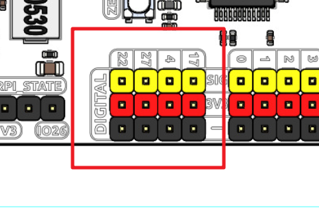

.. list-table:: Digital IO
    :widths: 25 50
    :header-rows: 1

    * - Fusion HAT+
      - Raspberry Pi 

    * - 17
      - GPIO17

    * - 4
      - GPIO4

    * - 27
      - GPIO27

    * - 22
      - GPIO22

.. _fh_pin_v0_adc:

ADC
-------

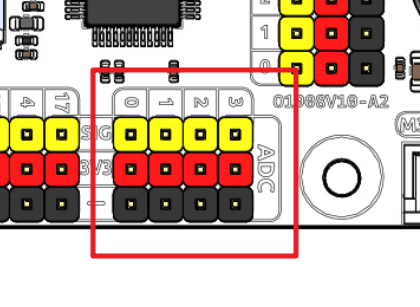

The Fusion HAT+ features four sets of 3 Pin ADC (Analog to Digital Converter) pins, each spaced 2.54mm apart. These pins operate at a 3.3V power supply. The ADC function, offering 12-bit precision, is facilitated by an onboard microcontroller. Detailed instructions for reading ADC values are provided in the :ref:`on_board_mcu` section.

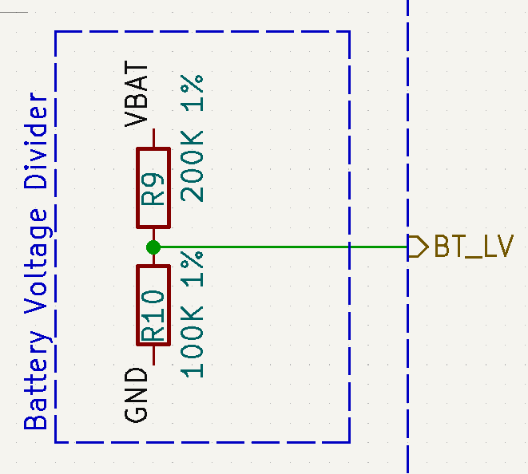

Also, ADC channel A4 is connected to the battery through a voltage divider using resistors, 
which will be used to measure the battery voltage to estimate the approximate battery charge.

The voltage divider ratio is 200K/100K, so:

* A4 voltage (Va4) = value_A4 / 4095.0 * 3.3
* Battery voltage (Vbat) = Va4*3
* Battery voltage (Vbat) = value_A4 / 4095.0 * 3.3 * 3

.. _fh_pin_v0_pwm:

PWM
--------

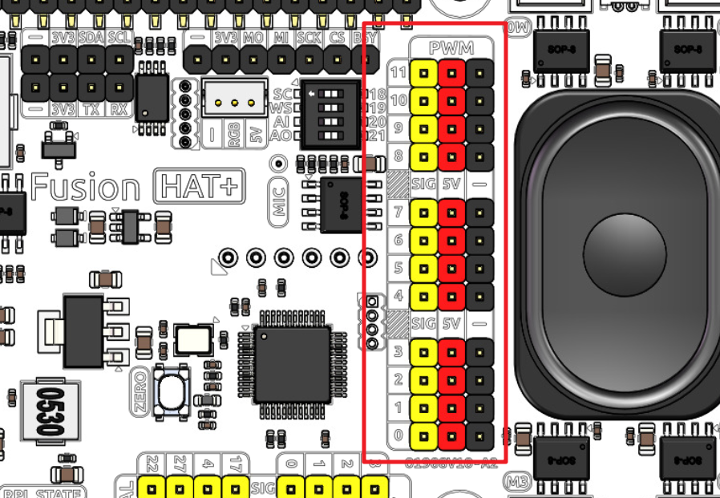

Fusion HAT+ has 4 sets of 3 Pin PWM pins, each spaced 2.54mm apart, and the power supply is 5V.
The method of using the PWM is described in detail in :ref:`on_board_mcu`.

.. note:: PWM4 ~ 11 channels are used for motor drive.

.. _fh_pin_v0_i2c:

I2C
----------

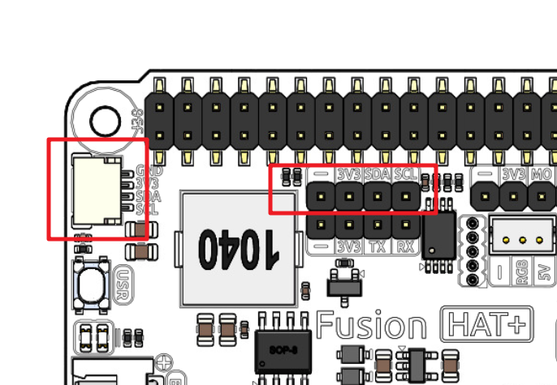

The Fusion HAT+ has two I2C interfaces. One is the P2.54 4-pin interface, and the other is the SH1.0 4-pin interface, which is compatible with QWIIC and STEMMA QT. 
These I2C interfaces are connected to the Raspberry Pi's I2C interface via GPIO2 (SDA) and GPIO3 (SCL). 
The board also features an :ref:`on_board_mcu`, and the two signal lines have 10K pull-up resistors.

.. _fh_pin_v0_spi:

SPI
---------

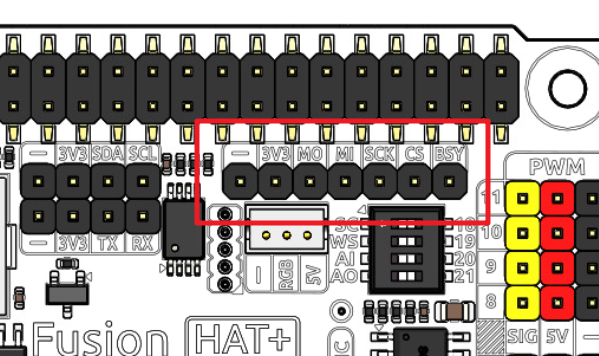

The SPI interface of the Fusion HAT+ is a 7-pin P2.54 interface. 
It connects to the SPI interface of the Raspberry Pi and includes an additional I/O pin that can be used for purposes such as interrupts or resets.

.. list-table:: SPI
    :widths: 50 50
    :header-rows: 1

    * - Fusion HAT+
      - Raspberry Pi 
    * - BSY
      - GPIO6
    * - CS
      - CE0(GPIO8)
    * - SCK
      - SCLK(GPIO11)
    * - MI
      - MISO(GPIO9)
    * - MO
      - MOSI(GPIO10)
    * - 3V3
      - 3.3V Power
    * - GND
      - Ground

.. _fh_pin_v0_uart:

UART
----------

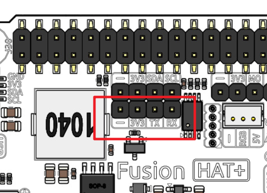

The UART interface of the Fusion HAT+ is a 4-pin P2.54 interface. 
It connects to the Raspberry Pi's GPIO14 (TXD) and GPIO15 (RXD) pins.

.. _fh_pin_v0_ws2812:

WS2812 Port
---------------

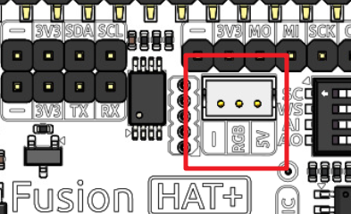

The Fusion HAT+ comes with 1 WS2812 port (ZH1.5 3 Pin), which can be used to control 1 WS2812 LED strip.

This Pin is shared with SPI MOSI, so it can not be used as SPI MOSI at the same time.

.. _fh_pin_v0_button:

User Button & LED
------------------------

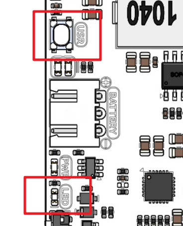

The Fusion HAT+ comes with 1 LED and 1 button which are connected to and controlled by the I2C chip.

.. _fh_pin_v0_speaker:

Speaker and MIC
----------------------------

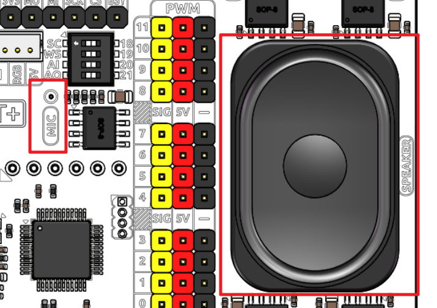

The Fusion HAT+ is equipped with onboard I2S audio output/input, along with a 2030 audio chamber speaker, providing a mono sound output. The onboard microphone can be used to receive audio signals.

.. list-table:: I2S
    :widths: 50 50
    :header-rows: 1

    * - I2S
      - Raspberry Pi
    * - WS
      - GPIO19
    * - SCLK
      - GPIO18
    * - Audio OUT (Speaker)
      - GPIO21
    * - Aduio IN (MIC)
      - GPIO20

If you intend to repurpose the GPIO pins without using the audio functionality, you can simply disconnect the integrated speaker and microphone via a switch. It is crucial to ensure that this disconnection is performed only when the audio components are inactive. Furthermore, you should never manipulate the WS and SCLK pins while any audio component is active.

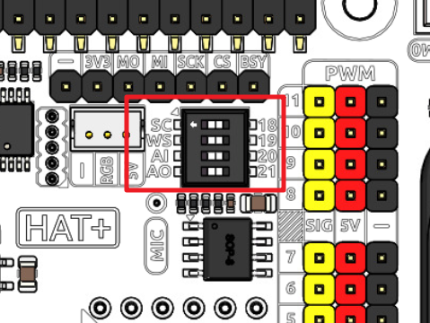

.. _fh_pin_v0_motor:

Motor Port
-----------------

The motor driver of the Fusion HAT+ supports 4 channels and can be controlled using 8 PWM signals for direction and speed control.

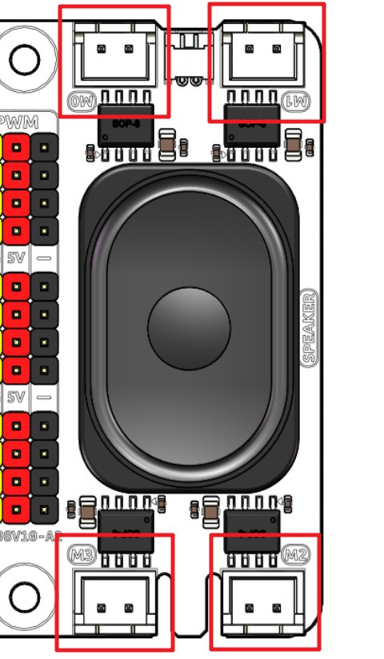

.. list-table:: Motor Driver
    :widths: 50 50
    :header-rows: 1

    * - Motor
      - PWM
    * - Motor0 A
      - PWM11
    * - Motor0 B
      - PWM10      
    * - Motor1 A
      - PWM9
    * - Motor1 B
      - PWM8
    * - Motor2 A
      - PWM7
    * - Motor2 B
      - PWM6
    * - Motor3 A
      - PWM5
    * - Motor3 B
      - PWM4

The motor drive mode is as follow.

.. list-table:: Motor Drive Mode
    :widths: 50 50 50
    :header-rows: 1

    * - A
      - B
      - Direction
    * - 0
      - 0
      - Standby
    * - PWM Value
      - 0
      - Forward
    * - 0
      - PWM Value
      - Reverse
    * - PWM Value
      - PWM Value
      - Brake

Power Button & PWR Indicator
------------------------------

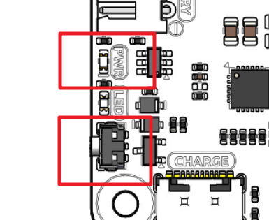

* Pressing the power button once will turn on the Raspberry Pi, and the PWR indicator will light up.
* Holding the power button for 2 seconds sends a shutdown signal to the Raspberry Pi. If it is properly configured, the Raspberry Pi will shut down and the PWR indicator will turn off.
* Holding the power button for 5 seconds forces a shutdown, and the PWR indicator will turn off immediately.

Additionally, the Fusion HAT+ features a :ref:`safe_shutdown` mechanism. It performs a software shutdown by reading the microcontroller’s register status via I2C.
To enable this feature, you need to configure the Raspberry Pi's shutdown signal pin and run the corresponding code on the Raspberry Pi.

.. _battery_indicator:

Battery Level Indicator
------------------------------

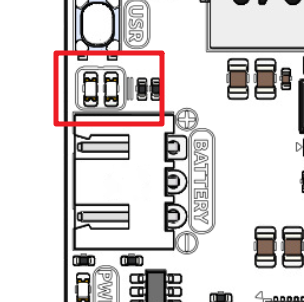

The battery level indicator on the Fusion HAT+ monitors the battery voltage using a voltage divider method and serves as a reference for estimating the battery level. 
The relationship between the LED and voltage is as follows:

.. list-table:: Battery Level
    :widths: 50 50
    :header-rows: 1

    * - LED Battery
      - Total Voltage
    * - 2 LEDs on
      - Greater than 7.4V
    * - 1 LED on
      - Greater than 6.5V
    * - Both LEDs off
      - Less than 6.5V

When charging, the battery indicator lights will flash. The charging status can be read via I2C by accessing the microcontroller. See :ref:`charging_status` for details.

When any one of the batteries reaches or exceeds 4.1V while the others are below that threshold, 
the charging current of that specific battery will be reduced.

.. _servo_zeroing_btn:

Servo Zeroing Button
-----------------------

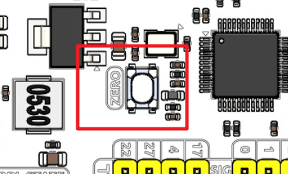

The servo zeroing button is used to calibrate the servo's zero position. 

The PWM interface supports servo zeroing control, making it convenient for robot assembly. Servo zeroing sets all PWM interfaces to a 1500 µs pulse width with a 20,000 µs period, which moves the servos to the 90° position. It is recommended to disconnect other PWM devices before entering the servo zeroing mode.  

* When you press the button twice, all the PWM signals will be set to 1500us pulse, 20000us period. That is, the servo will be in the middle position. You should secure the servo arm to the servo in this state.
* Press the button twice again, all the PWM signals will be set to 0 pulse.
