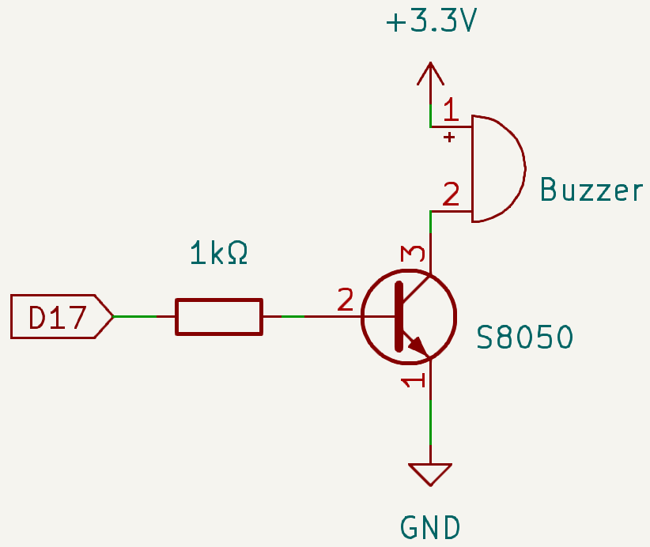
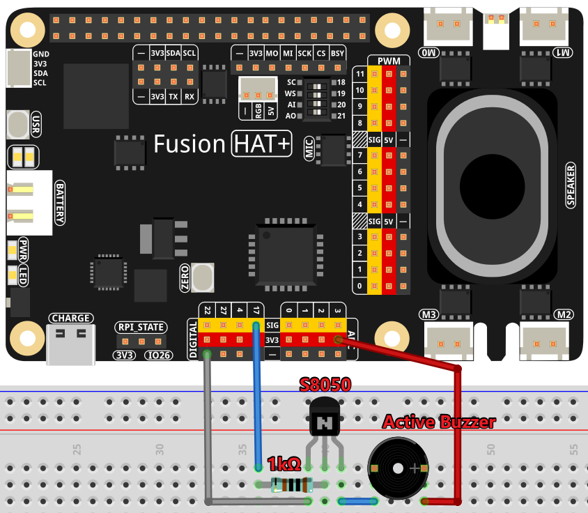

.. note::

    Hello, welcome to the SunFounder Raspberry Pi & Arduino & ESP32 Enthusiasts Community on Facebook! Dive deeper into Raspberry Pi, Arduino, and ESP32 with fellow enthusiasts.

    **Why Join?**

    - **Expert Support**: Solve post-sale issues and technical challenges with help from our community and team.
    - **Learn & Share**: Exchange tips and tutorials to enhance your skills.
    - **Exclusive Previews**: Get early access to new product announcements and sneak peeks.
    - **Special Discounts**: Enjoy exclusive discounts on our newest products.
    - **Festive Promotions and Giveaways**: Take part in giveaways and holiday promotions.

    👉 Ready to explore and create with us? Click [|link_sf_facebook|] and join today!

.. _exp_ac_buzzer:

Active Buzzer
=========================================

**Introduction**

In this project, we will learn how to drive an active buzzer to produce a beeping sound using a NPN transistor. Active buzzers are simple components used in many electronic projects to produce sound signals.

----------------------------------------------

**Circuit Diagram**

The circuit uses an active buzzer, a NPN transistor, and a 1kΩ resistor. The resistor protects the transistor by limiting the base current. When GPIO17 outputs a high level (3.3V), the transistor conducts, allowing current to flow through the buzzer, causing it to beep. When GPIO17 outputs a low level, the transistor is cut off, and the buzzer remains silent.

----------------------------------------------

**Wiring Diagram**

Follow these steps to build the circuit:

1. Place the NPN transistor, buzzer, and resistor on the breadboard.
2. Connect the base of the transistor to GPIO17 through the resistor.
3. Connect the emitter of the transistor to the power supply (+).
4. Connect the collector of the transistor to one terminal of the buzzer.
5. Connect the other terminal of the buzzer to the ground (-).

----------------------------------------------

**Code**

The following Python code drives the active buzzer to beep on and off in a loop:

.. raw:: html

   <run></run>

.. code-block:: python

   #!/usr/bin/env python3
   from fusion_hat.modules import Buzzer
   from fusion_hat.pin import Pin
   from time import sleep

   # Initialize a Buzzer object on GPIO pin 17
   buzzer = Buzzer(Pin(17))

   try:
      while True:
         # Turn on the buzzer
         print('Buzzer On')
         buzzer.on()
         sleep(0.1)  # Keep the buzzer on for 0.1 seconds

         # Turn off the buzzer
         print('Buzzer Off')
         buzzer.off()
         sleep(0.1)  # Keep the buzzer off for 0.1 seconds

   except KeyboardInterrupt:
      # Handle KeyboardInterrupt (Ctrl+C) for clean script termination
      pass

This Python script controls a buzzer connected to GPIO pin 17 on a Raspberry Pi. When executed:

1. The buzzer alternates between turning on and off every 0.1 seconds, producing a beeping sound.
2. The program prints "Buzzer On" and "Buzzer Off" to the console in sync with the buzzer's operation.
3. The buzzing continues indefinitely until the user interrupts the script by pressing ``Ctrl+C``.

