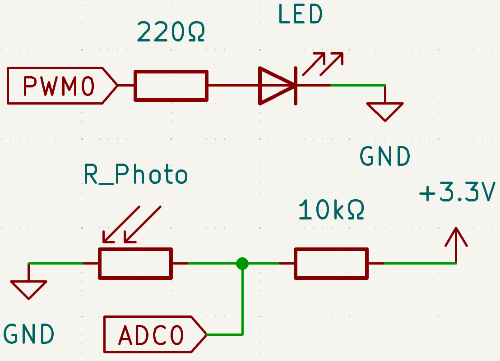
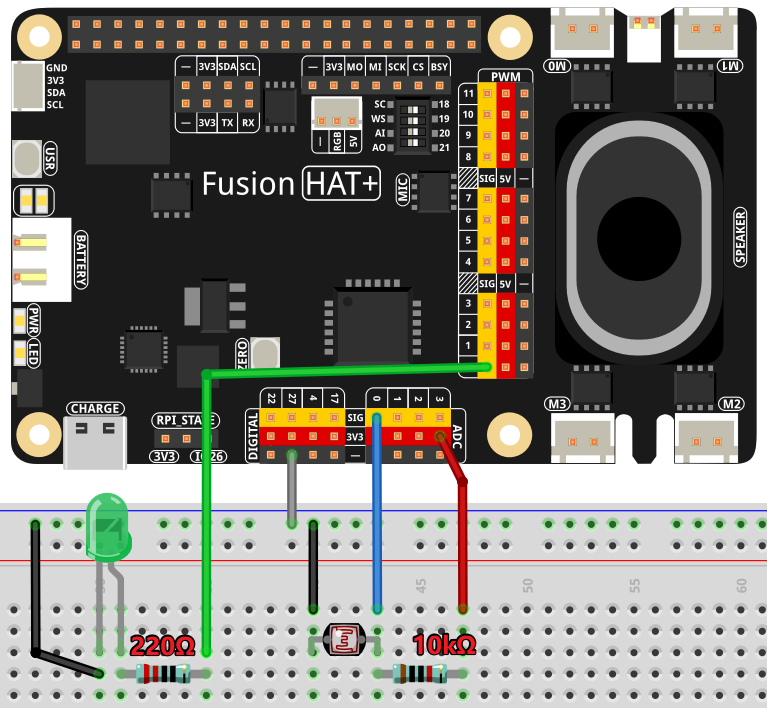

.. note::

    Hello, welcome to the SunFounder Raspberry Pi & Arduino & ESP32 Enthusiasts Community on Facebook! Dive deeper into Raspberry Pi, Arduino, and ESP32 with fellow enthusiasts.

    **Why Join?**

    - **Expert Support**: Solve post-sale issues and technical challenges with help from our community and team.
    - **Learn & Share**: Exchange tips and tutorials to enhance your skills.
    - **Exclusive Previews**: Get early access to new product announcements and sneak peeks.
    - **Special Discounts**: Enjoy exclusive discounts on our newest products.
    - **Festive Promotions and Giveaways**: Take part in giveaways and holiday promotions.

    👉 Ready to explore and create with us? Click [|link_sf_facebook|] and join today!

.. _exp_adc:

ADC
===========================

**Introduction**

A photoresistor, also known as a light-dependent resistor (LDR), is a component that detects light intensity. Its resistance decreases as the light intensity increases, making it useful in devices like automatic night lamps and ambient light controllers. 

This project demonstrates how to use a photoresistor with Fusion HAT+ to adjust an LED's brightness based on ambient light levels. The working principle is similar to a potentiometer, except the input is light instead of manual adjustment.

----------------------------------------------

**Circuit Diagram**

Below are the schematic diagrams illustrating how to connect the components:

----------------------------------------------

**Wiring Diagram**

Build the circuit as shown in the diagram below:

Ensure that:

- The photoresistor is connected to the Fusion HAT+ to convert analog signals into digital values.
- The LED is connected to a GPIO pin for PWM control.
- All connections are secure, and power and ground connections are properly set.

----------------------------------------------

**Code**

Below is the Python code used in this project:

.. raw:: html

   <run></run>

.. code-block:: python

   #!/usr/bin/env python3

   from fusion_hat.adc import ADC
   from fusion_hat.pwm import PWM
   import time

   # Initialize a PWM LED
   led = PWM('P0')

   # Set up the potentiometer
   photoresistor = ADC('A0')

   def MAP(x, in_min, in_max, out_min, out_max):

      return (x - in_min) * (out_max - out_min) / (in_max - in_min) + out_min

   try:
      while True:
         # Get the current reading from the ADC port
         result = photoresistor.read()
         print('result = %d ' %result)

         # Map the ADC value to a range suitable for setting LED brightness
         value = MAP(result, 0, 4095, 0, 100)

         # Set the LED brightness
         led.pulse_width_percent(value)

         # Wait for 1 seconds before reading again
         time.sleep(0.2)

   # Graceful exit when 'Ctrl+C' is pressed
   except KeyboardInterrupt: 
      led.pulse_width_percent(0)  # Turn off the LED

This Python script continuously reads the photoresistor's value, maps it to a suitable range for setting the LED brightness, and adjusts the LED's brightness accordingly. The script also includes a graceful exit mechanism to turn off the LED when interrupted by the user. When executed:

1. The Fusion HAT+ continuously reads photoresistor values from its input channel (ranging from 0 to 4095).
2. The analog value, representing light intensity or another variable input, is printed to the console as ``result =  <value>``.
3. The script maps the analog value to a PWM signal to adjust the brightness of the LED.
4. The LED brightness dynamically changes based on the ADC input, with updates every 0.2 seconds.
5. The program runs indefinitely until interrupted with ``Ctrl+C``, at which point the LED turns off.

