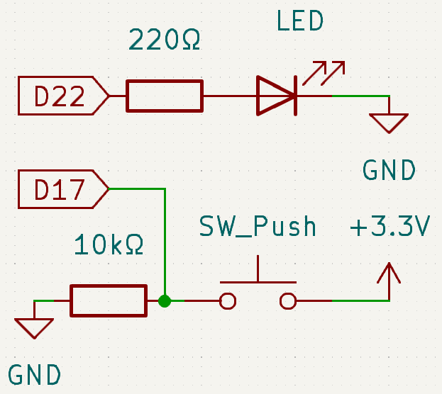
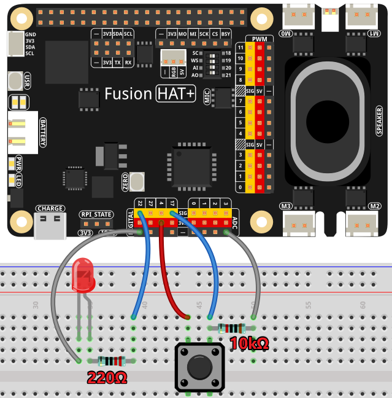

.. note::

    Hello, welcome to the SunFounder Raspberry Pi & Arduino & ESP32 Enthusiasts Community on Facebook! Dive deeper into Raspberry Pi, Arduino, and ESP32 with fellow enthusiasts.

    **Why Join?**

    - **Expert Support**: Solve post-sale issues and technical challenges with help from our community and team.
    - **Learn & Share**: Exchange tips and tutorials to enhance your skills.
    - **Exclusive Previews**: Get early access to new product announcements and sneak peeks.
    - **Special Discounts**: Enjoy exclusive discounts on our newest products.
    - **Festive Promotions and Giveaways**: Take part in giveaways and holiday promotions.

    👉 Ready to explore and create with us? Click [|link_sf_facebook|] and join today!

.. _exp_gpio_in:

GPIO Input
==============

**Introduction**

In this project, we will learn how to use a button to control an LED. Buttons are fundamental input devices used in various electronic projects to interact with circuits and systems.

----------------------------------------------

**Circuit Diagram**

We will use a normally open button as an input for the Raspberry Pi. When the button is pressed, GPIO17 will receive a high-level signal (3.3V). The Raspberry Pi will detect this signal and turn the LED on. The circuit connections are shown in the diagrams below:

----------------------------------------------

**Wiring Diagram**

Follow these steps to build the circuit:

1. Connect the anode (long pin) of the LED to a GPIO pin (GPIO22) through a current-limiting resistor.
2. Connect the cathode (short pin) of the LED to the ground (GND).
3. Connect one terminal of the button to GPIO17 and the other terminal to the ground (GND).

----------------------------------------------

**Code**

The following Python code toggles the LED based on button presses and releases:

.. raw:: html

   <run></run>

.. code-block:: python

   #!/usr/bin/env python3
   from fusion_hat.pin import Pin, Mode, Pull
   from signal import pause  # Import pause function from signal module

   # Initialize an LED object on GPIO pin 22
   led = Pin(22,mode=Mode.OUT)
   # Initialize a Button object on GPIO pin 17
   button = Pin(17, mode=Mode.IN, pull=Pull.DOWN)

   # # Link the button's "when_activated" event to the LED's high() method
   button.when_activated = led.high

   # # Link the button's "when_deactivated" event to the LED's low() method
   button.when_deactivated = led.low

   # Run an event loop that waits for button events and keeps the script running
   print("CTRL + C to exit")
   pause()

This Python script demonstrates an interactive setup where a button controls an LED. When executed:

1. Pressing the button (connected to GPIO pin 17) turns the LED (connected to GPIO pin 22) on.
2. Releasing the button turns the LED off.
3. The program runs indefinitely, listening for button press and release events to control the LED.

