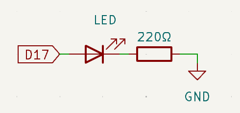
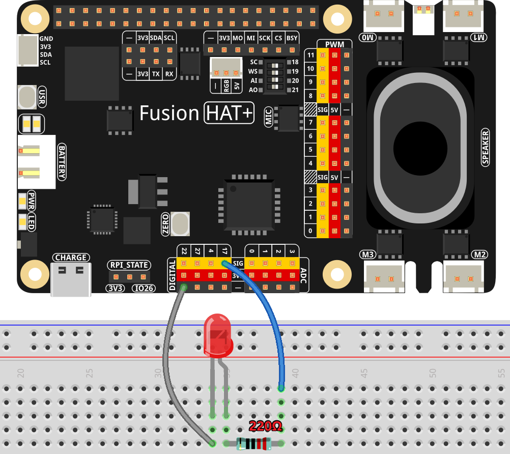

.. note::

    Hello, welcome to the SunFounder Raspberry Pi & Arduino & ESP32 Enthusiasts Community on Facebook! Dive deeper into Raspberry Pi, Arduino, and ESP32 with fellow enthusiasts.

    **Why Join?**

    - **Expert Support**: Solve post-sale issues and technical challenges with help from our community and team.
    - **Learn & Share**: Exchange tips and tutorials to enhance your skills.
    - **Exclusive Previews**: Get early access to new product announcements and sneak peeks.
    - **Special Discounts**: Enjoy exclusive discounts on our newest products.
    - **Festive Promotions and Giveaways**: Take part in giveaways and holiday promotions.

    👉 Ready to explore and create with us? Click [|link_sf_facebook|] and join today!

.. _exp_gpio_out:

GPIO Output
==================

**Introduction**

In this tutorial, we’ll connect an LED to a GPIO pin and write a Python program to make it blink. Let’s get started!

----------------------------------------------

**Circuit Diagram**

Here’s how the circuit should look:

* **GPIO Pin 17** connects to the anode (long pin) of the LED.
* The cathode (short pin) of the LED connects to one leg of the resistor.
* The other leg of the resistor connects to the **GND** (Ground) pin.

The resistor limits the current flowing through the LED, preventing it from burning out. Without a resistor, the LED may draw too much current, which can damage both the LED and the Raspberry Pi.

----------------------------------------------

**Wiring Diagram**

Follow the wiring diagram below to connect your components:

----------------------------------------------

**Code**

Let’s write the Python code to control the LED. You’ll create a script that turns the LED on and off at regular intervals.

Here’s the complete Python script for this project:

.. raw:: html

   <run></run>

.. code-block:: python

   #!/usr/bin/env python3
   from fusion_hat.pin import Pin, Mode
   from time import sleep

   # Initialize an LED connected to GPIO pin 17 as an output pin.
   led = Pin(17,mode=Mode.OUT)

   try:
      # Start an infinite loop to toggle the LED state.
      while True:
         # Turn on the LED and print a message to the console.
         led.high()
         print('...LED ON')

         # Wait for 0.5 seconds with the LED on.
         sleep(0.5)

         # Turn off the LED and print a message to the console.
         led.low()
         print('LED OFF...')

         # Wait for 0.5 seconds with the LED off.
         sleep(1)

   except KeyboardInterrupt:
      # Gracefully handle a keyboard interrupt (Ctrl+C) by breaking the loop.
      pass

This Python script controls an LED connected to GPIO pin 17 of a Raspberry Pi. When executed, the LED alternates between turning on and off in half-second intervals. Simultaneously, the console prints "LED is ON" and "LED is OFF" to indicate the LED's current state. The program runs indefinitely until interrupted by a user pressing ``Ctrl+C``.

