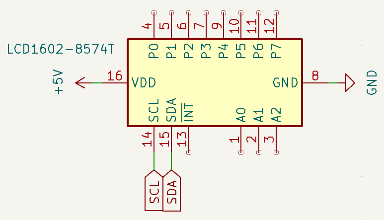
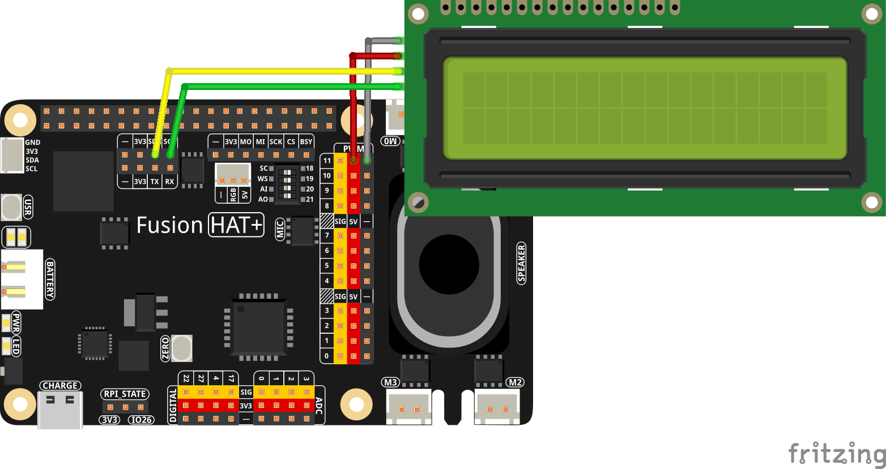

.. note::

    Hello, welcome to the SunFounder Raspberry Pi & Arduino & ESP32 Enthusiasts Community on Facebook! Dive deeper into Raspberry Pi, Arduino, and ESP32 with fellow enthusiasts.

    **Why Join?**

    - **Expert Support**: Solve post-sale issues and technical challenges with help from our community and team.
    - **Learn & Share**: Exchange tips and tutorials to enhance your skills.
    - **Exclusive Previews**: Get early access to new product announcements and sneak peeks.
    - **Special Discounts**: Enjoy exclusive discounts on our newest products.
    - **Festive Promotions and Giveaways**: Take part in giveaways and holiday promotions.

    👉 Ready to explore and create with us? Click [|link_sf_facebook|] and join today!

.. _exp_i2c:

I2C (LCD1602)
======================

**Introduction**

The Fusion HAT+ have two different I2C ports, which can be used to connect multiple I2C devices. In this project, we will use the I2C port to connect an LCD1602 display.

.. image:: /hardware/img/i2cfh_pin_v0.png

The LCD1602 is a 16x2 character-type liquid crystal display capable of displaying up to 32 characters at a time. It uses the I2C communication protocol, reducing the number of GPIO pins required for control. This project demonstrates how to interface with the LCD1602 to display text messages.

----------------------------------------------

**Circuit Diagram**

The circuit diagram below shows how to connect the LCD1602 to the Raspberry Pi using the I2C interface.

----------------------------------------------

**Wiring Diagram**

Follow these steps to build the circuit:

1. Connect the I2C interface pins (SDA and SCL) of the LCD1602 to the corresponding pins on the Fusiuon HAT.
2. Ensure proper power supply connections to the LCD1602.
3. Verify the wiring to avoid errors.

----------------------------------------------

**Writing the Code**

The following Python code initializes the LCD1602 and displays a simple greeting message:

.. raw:: html

   <run></run>

.. code-block:: python

   from fusion_hat.modules import LCD1602
   from time import sleep

   lcd = LCD1602(address=0x27, backlight=1)

   while True:
      lcd.clear()
      lcd.write(0, 0, 'Greetings!')
      lcd.write(1, 1, 'From SunFounder')
      sleep(1)
      lcd.clear()
      lcd.message('Hello\n   World!')
      sleep(1)

This Python script interfaces with an LCD1602 display module to present a brief message. When executed:

1. It initializes the LCD1602 display with I2C communication (default address ``0x27``).
2. The first line of the display shows the text "Greetings!".
3. The second line displays the text "From SunFounder".
4. The messages remain visible for 1 seconds before the next text.

The display clears if the user interrupts the script by pressing ``Ctrl+C``.

