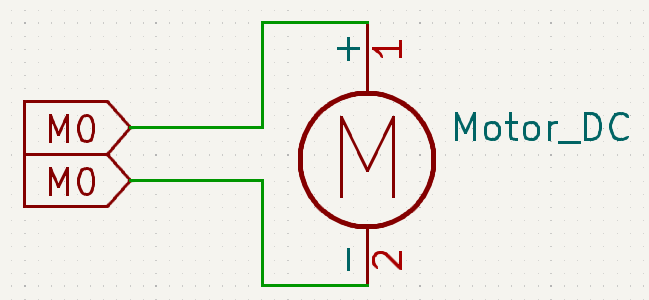
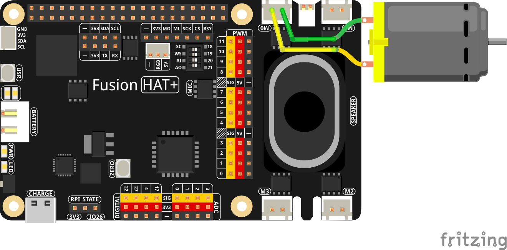

.. note::

    Hello, welcome to the SunFounder Raspberry Pi & Arduino & ESP32 Enthusiasts Community on Facebook! Dive deeper into Raspberry Pi, Arduino, and ESP32 with fellow enthusiasts.

    **Why Join?**

    - **Expert Support**: Solve post-sale issues and technical challenges with help from our community and team.
    - **Learn & Share**: Exchange tips and tutorials to enhance your skills.
    - **Exclusive Previews**: Get early access to new product announcements and sneak peeks.
    - **Special Discounts**: Enjoy exclusive discounts on our newest products.
    - **Festive Promotions and Giveaways**: Take part in giveaways and holiday promotions.

    👉 Ready to explore and create with us? Click [|link_sf_facebook|] and join today!

.. _exp_motor:

Motor
=============

**Introduction**

In this project, we will learn how to use the Fusion HAT+ to control a DC motor, making it rotate clockwise and counterclockwise.

----------------------------------------------

**Circuit Diagram**

The circuit diagram below shows the connections required to control the motor.

----------------------------------------------

**Wiring Diagram**

----------------------------------------------

**Code**

The following Python code controls the motor’s rotation direction and timing:

.. raw:: html

   <run></run>

.. code-block:: python

   #!/usr/bin/env python3
   # Import sleep function to pause execution
   from time import sleep
   # Import Motor class from the fusion_hat.motor module
   from fusion_hat.motor import Motor

   # Create a Motor object for motor port 'M0'
   # is_reversed=True means the motor direction is inverted
   motor = Motor('M0', is_reversed=True)

   try:
      # Loop forever
      while True:
         motor.power(0)       # Stop the motor
         sleep(0.5)           # Wait 0.5 seconds
         
         motor.power(-50)     # Run the motor at -50% power
         sleep(1)             # Run for 1 second
         
         motor.power(0)       # Stop again
         sleep(0.5)           # Wait 0.5 seconds
         
         motor.power(75)      # Run the motor at 75% power
         sleep(1)             # Run for 1 second

   finally:
      motor.stop()             # Ensure the motor is stopped on exit
      sleep(.1)                # Short delay for safety

