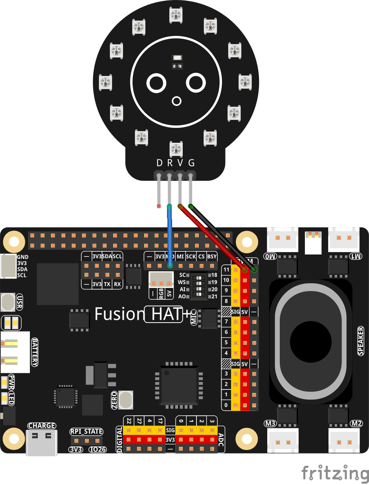

.. note::

    Hello, welcome to the SunFounder Raspberry Pi & Arduino & ESP32 Enthusiasts Community on Facebook! Dive deeper into Raspberry Pi, Arduino, and ESP32 with fellow enthusiasts.

    **Why Join?**

    - **Expert Support**: Solve post-sale issues and technical challenges with help from our community and team.
    - **Learn & Share**: Exchange tips and tutorials to enhance your skills.
    - **Exclusive Previews**: Get early access to new product announcements and sneak peeks.
    - **Special Discounts**: Enjoy exclusive discounts on our newest products.
    - **Festive Promotions and Giveaways**: Take part in giveaways and holiday promotions.

    👉 Ready to explore and create with us? Click [|link_sf_facebook|] and join today!

.. _exp_neopixel:

NeoPixel LED Strip
===========================

**Introduction**

In this project, we will learn how to control an addressable RGB LED strip (NeoPixel) using SPI communication on a Raspberry Pi. NeoPixels are intelligent RGB LEDs that contain their own drivers, allowing individual control of each LED in a chain. This project demonstrates basic color control and filling the entire strip with different colors.

----------------------------------------------

**Wiring Diagram**

----------------------------------------------

**Setup**

#. Before running the code, you need to install the required library:

   This library provides the necessary functions to control NeoPixel LEDs using SPI communication.

   .. raw:: html
   
      <run></run>
   
   .. code-block:: shell
   
      sudo pip install git+https://github.com/sunfounder/sunfounder-imu-python.git --break-system-packages
   

----------------------------------------------

**Code**

The following Python code controls a NeoPixel LED strip, cycling through different colors:

.. code-block:: python

   import time               # Used for delays
   import board              # Provides board-specific pin definitions
   import neopixel_spi as neopixel   # NeoPixel SPI driver

   # Create an SPI object using the default SPI bus of the board
   spi = board.SPI()

   LED_COUNT = 12  # Number of LED pixels in the strip
   PIXEL_ORDER = neopixel.GRB  # Color order used by the LEDs (Green, Red, Blue)

   # Create a NeoPixel strip object over SPI
   # auto_write=False means we must call strip.show() to update the LEDs
   strip = neopixel.NeoPixel_SPI(spi, LED_COUNT, pixel_order=PIXEL_ORDER, auto_write=False)

   time.sleep(0.01)   # Short delay to ensure the strip is ready

   strip.fill(0)      # Turn all pixels off (color value 0 = off)
   strip.show()       # Send the data to the LED strip

   try:
      while True:
         print("RGB test")

         # Display red on all LEDs
         print("Red")
         strip.fill((255, 0, 0))  # Full red, no green, no blue
         strip.show()
         time.sleep(1)

         # Display green on all LEDs
         print("Green")
         strip.fill((0, 255, 0))  # Full green
         strip.show()
         time.sleep(1)

         # Display blue on all LEDs
         print("Blue")
         strip.fill((0, 0, 255))  # Full blue
         strip.show()
         time.sleep(1)
      
         # Turn all LEDs off
         # print("Off for 10 seconds")
         strip.fill((0, 0, 0))    # All channels 0 = off
         strip.show()
         time.sleep(1)

   # Gracefully handle script termination (e.g., via KeyboardInterrupt)
   except KeyboardInterrupt: 
      pass

This Python script demonstrates basic control of a 12-LED WS2812 ring using the NeoPixel SPI driver. When executed:

1. The script initializes the SPI interface and prepares the WS2812 LED ring.
2. All LEDs cycle through red, green, and blue with 1-second intervals.
3. Each color change is printed to the console for debugging.
4. The LEDs briefly turn off between cycles.
5. The program loops continuously until interrupted with Ctrl+C.

Troubleshooting
---------------

* **LED Ring Not Lighting Correctly**

  - **Cause:** Wrong wiring or insufficient power  
  - **Solution:** Ensure VCC is 5V, GND is shared, and the data line is connected to DIN (sometimes labeled RGB)

* **Incorrect Colors**

  - **Cause:** LED color order mismatch  
  - **Solution:** Try different pixel orders such as ``neopixel.RGB`` or ``neopixel.GRBW``

* **SPI Not Working**

  - **Cause:** SPI disabled or hardware conflict  
  - **Solution:** Enable SPI via ``sudo raspi-config``
  
* **Library Import Fails**

  - **Cause:** Missing dependency  
  - **Solution:**
  
  .. code-block:: bash

      sudo pip3 install adafruit-circuitpython-neopixel-spi --break
