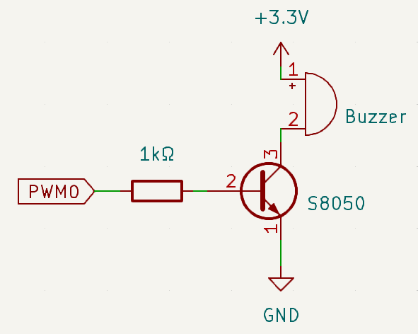

.. note::

    Hello, welcome to the SunFounder Raspberry Pi & Arduino & ESP32 Enthusiasts Community on Facebook! Dive deeper into Raspberry Pi, Arduino, and ESP32 with fellow enthusiasts.

    **Why Join?**

    - **Expert Support**: Solve post-sale issues and technical challenges with help from our community and team.
    - **Learn & Share**: Exchange tips and tutorials to enhance your skills.
    - **Exclusive Previews**: Get early access to new product announcements and sneak peeks.
    - **Special Discounts**: Enjoy exclusive discounts on our newest products.
    - **Festive Promotions and Giveaways**: Take part in giveaways and holiday promotions.

    👉 Ready to explore and create with us? Click [|link_sf_facebook|] and join today!

.. _exp_pa_buzzer:

Passive Buzzer
===========================

**Introduction**

In this project, we will learn how to make a passive buzzer play music by driving it with different frequencies. Passive buzzers, unlike active buzzers, require an external signal to produce sound.

----------------------------------------------

**Circuit Diagram**

The circuit uses a passive buzzer, a NPN transistor, and a 1kΩ resistor. The resistor protects the transistor from excessive current. By varying the frequency of the GPIO pin connected to the transistor, the buzzer produces different sounds, enabling it to play music.

----------------------------------------------

**Wiring Diagram**

Follow these steps to build the circuit:

1. Connect the base of the NPN transistor to PWM0 through the resistor.
2. Connect the emitter of the transistor to the power supply (+).
3. Connect the collector of the transistor to one terminal of the passive buzzer.
4. Connect the other terminal of the buzzer to the ground (-).

.. image:: img/fzz/1.2.2_bb.png
   :width: 80%
   :align: center

----------------------------------------------

**Code**

The following Python code generates musical notes using a passive buzzer:

.. raw:: html

   <run></run>

.. code-block:: python

   #!/usr/bin/env python3
   from fusion_hat.modules import Buzzer
   from fusion_hat.pwm import PWM
   from time import sleep

   # Initialize a TonalBuzzer connected to PWM 0
   tb = Buzzer(PWM('P0'))  # Update this pin number based on your setup

   def play(tune):
      """
      Play a musical tune using the buzzer.
      :param tune: List of tuples (note, duration), where each tuple represents a note and its duration.
      """
      for note, duration in tune:
         print(note)  # Output the current note being played
         tb.play(note,float(duration))  # Play the note on the buzzer
      tb.off()  # Stop playing after the tune is complete

   # Define a musical tune as a sequence of notes and durations
   tune = [('C#4', 0.2), ('D4', 0.2), (None, 0.2),
      ('Eb4', 0.2), ('E4', 0.2), (None, 0.6),
      ('F#4', 0.2), ('G4', 0.2), (None, 0.6),
      ('Eb4', 0.2), ('E4', 0.2), (None, 0.2),
      ('F#4', 0.2), ('G4', 0.2), (None, 0.2),
      ('C4', 0.2), ('B4', 0.2), (None, 0.2),
      ('F#4', 0.2), ('G4', 0.2), (None, 0.2),
      ('B4', 0.2), ('Bb4', 0.5), (None, 0.6),
      ('A4', 0.2), ('G4', 0.2), ('E4', 0.2), 
      ('D4', 0.2), ('E4', 0.2)]

   try:
      play(tune)  # Execute the play function to start playing the tune

   except KeyboardInterrupt:
      # Handle KeyboardInterrupt for graceful termination
      pass

This Python script plays a musical tune using a passive buzzer connected to PWM 0. When executed:

1. The script iterates through a predefined sequence of musical notes (``tune``), playing each note for a specified duration.
2. The notes are output to the console as they are played, providing a visual reference.
3. The tune stops automatically once all notes are played. The buzzer produces no sound during pauses (when the note is ``None``).
4. The program can be interrupted gracefully using ``Ctrl+C``.

