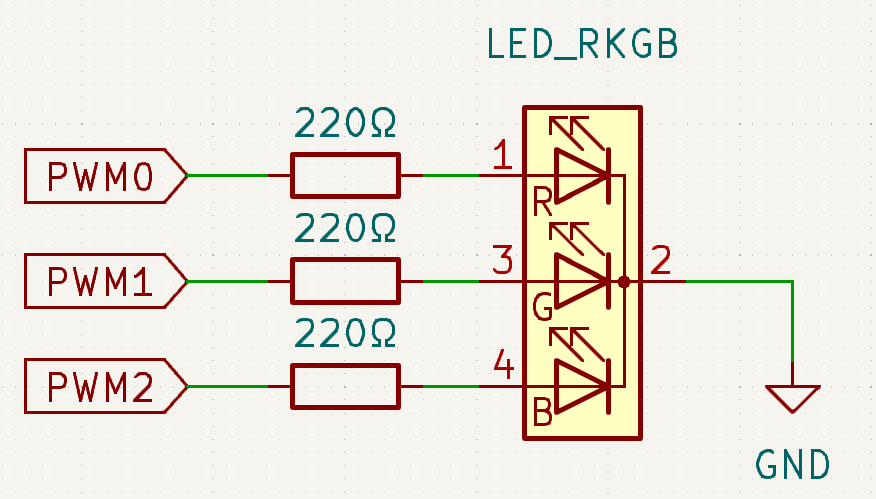
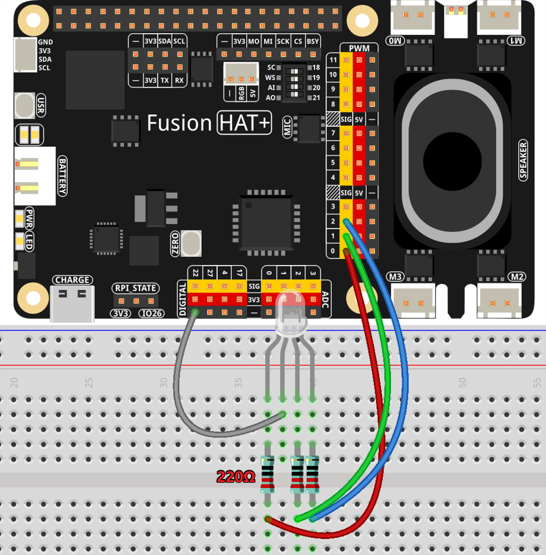

.. note::

    Hello, welcome to the SunFounder Raspberry Pi & Arduino & ESP32 Enthusiasts Community on Facebook! Dive deeper into Raspberry Pi, Arduino, and ESP32 with fellow enthusiasts.

    **Why Join?**

    - **Expert Support**: Solve post-sale issues and technical challenges with help from our community and team.
    - **Learn & Share**: Exchange tips and tutorials to enhance your skills.
    - **Exclusive Previews**: Get early access to new product announcements and sneak peeks.
    - **Special Discounts**: Enjoy exclusive discounts on our newest products.
    - **Festive Promotions and Giveaways**: Take part in giveaways and holiday promotions.

    👉 Ready to explore and create with us? Click [|link_sf_facebook|] and join today!

.. _exp_pwm:

PWM
====================

**Introduction**

In this project, we will explore how to control an RGB LED to display various colors by using a Raspberry Pi and GPIO programming. RGB LEDs are versatile components that can emit a spectrum of colors by mixing red, green, and blue light at different intensities.

----------------------------------------------

**Circuit Diagram**

After connecting the R, G, and B pins of the RGB LED to current-limiting resistors, connect these resistors to PWM0, PWM1, and PWM2, respectively. The longest pin of the LED (GND) is connected to the GND pin of the Raspberry Pi. Different PWM values for the three pins produce various colors.

----------------------------------------------

**Wiring Diagram**

Follow the steps below to build the circuit:

1. Place the RGB LED on the breadboard.
2. Connect the red, green, and blue pins of the LED to P0, P1, and P2 through resistors.
3. Connect the longest pin (GND) of the LED to the GND of the Raspberry Pi.

----------------------------------------------

**Code**

The following Python code cycles through various colors on the RGB LED by setting different PWM values for the red, green, and blue components:

.. raw:: html

   <run></run>

.. code-block:: python

   #!/usr/bin/env python3
   from fusion_hat.modules import RGB_LED
   from fusion_hat.pwm import PWM
   from time import sleep

   # Initialize an RGB LED. Connect the red component to P0, green to P1, and blue to P2.
   rgb_led = RGB_LED(PWM(0), PWM(1), PWM(2), common=RGB_LED.CATHODE)

   try:
      # Set the RGB LED to red.
      rgb_led.color((255, 0, 0))
      sleep(1)

      # Set the RGB LED to green.
      rgb_led.color("#00FF22") 
      sleep(1)

      # Set the RGB LED to purple.
      rgb_led.color(0xFF00FF)  
      sleep(1)

      # Set the RGB LED to black.
      rgb_led.color(0x000000)  

   except KeyboardInterrupt:
      # Handle a KeyboardInterrupt (Ctrl+C) to exit.
      rgb_led.color(0x000000)  
      pass

This script demonstrates how to control an RGB LED using the Fusion Hat library. It initializes the RGB LED with specific PWM pins and sets different colors sequentially.

