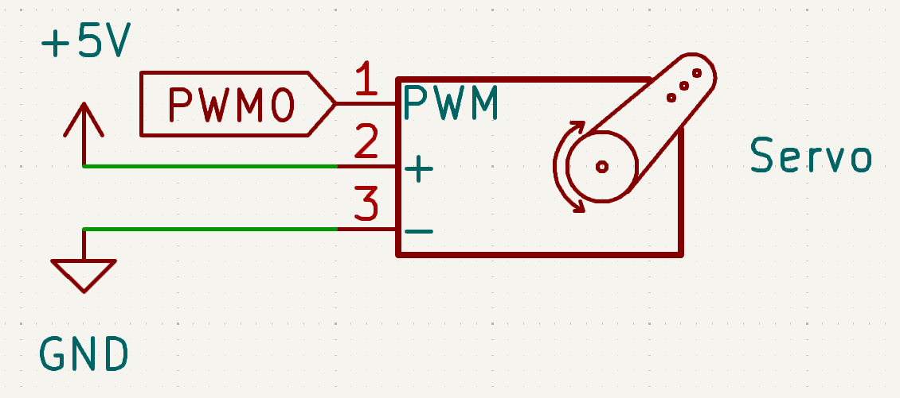

.. note::

    Hello, welcome to the SunFounder Raspberry Pi & Arduino & ESP32 Enthusiasts Community on Facebook! Dive deeper into Raspberry Pi, Arduino, and ESP32 with fellow enthusiasts.

    **Why Join?**

    - **Expert Support**: Solve post-sale issues and technical challenges with help from our community and team.
    - **Learn & Share**: Exchange tips and tutorials to enhance your skills.
    - **Exclusive Previews**: Get early access to new product announcements and sneak peeks.
    - **Special Discounts**: Enjoy exclusive discounts on our newest products.
    - **Festive Promotions and Giveaways**: Take part in giveaways and holiday promotions.

    👉 Ready to explore and create with us? Click [|link_sf_facebook|] and join today!

.. _exp_servo:

Servo
==============================

**Introduction**

In this project, we will learn how to control a servo motor using a Raspberry Pi. Servo motors are commonly used in robotics and automation for precise control of angular motion.

----------------------------------------------

**Circuit Diagram**

The circuit diagram below shows the connections required for controlling the servo motor.

----------------------------------------------

**Wiring Diagram**

.. image:: img/fzz/1.3.2_bb.png
   :width: 80%
   :align: center

----------------------------------------------

**Code**

The following Python code demonstrates how to control the servo motor by moving it between various angles:

.. raw:: html

   <run></run>

.. code-block:: python

   from fusion_hat.servo import Servo   # Import the Servo class for controlling servos
   from time import sleep               # Import sleep for timing delays

   servo = Servo(0)                     # Create a Servo object on channel 0

   while True:                          # Loop forever
      # Sweep from -90° to +90° in steps of 10°
      for i in range(-90, 91, 10):
         servo.angle(i)               # Set servo to angle i
         sleep(0.1)                   # Small delay for smooth movement

      # Sweep back from +90° to -90° in steps of -10°
      for i in range(90, -91, -10):
         servo.angle(i)               # Set servo to angle i
         sleep(0.1)                   # Small delay for smooth movement

This Python script controls a servo motor connected to PWM 0. When executed:

1. The servo moves from -90 degrees to 90 degrees in 10-degree increments.
2. It pauses for 0.1 seconds between each movement.
3. It then reverses the direction and moves from 90 degrees to -90 degrees in 10-degree increments.
4. The process repeats indefinitely.

