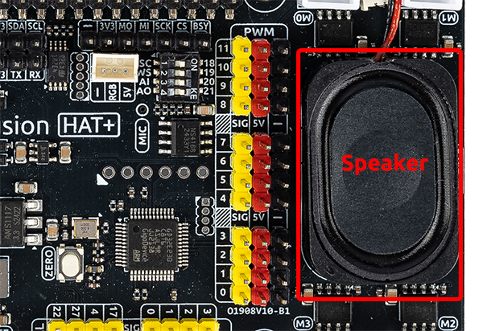

.. note::

    Hello, welcome to the SunFounder Raspberry Pi & Arduino & ESP32 Enthusiasts Community on Facebook! Dive deeper into Raspberry Pi, Arduino, and ESP32 with fellow enthusiasts.

    **Why Join?**

    - **Expert Support**: Solve post-sale issues and technical challenges with help from our community and team.
    - **Learn & Share**: Exchange tips and tutorials to enhance your skills.
    - **Exclusive Previews**: Get early access to new product announcements and sneak peeks.
    - **Special Discounts**: Enjoy exclusive discounts on our newest products.
    - **Festive Promotions and Giveaways**: Take part in giveaways and holiday promotions.

    👉 Ready to explore and create with us? Click [|link_sf_facebook|] and join today!

.. _exp_speaker:

Fusion HAT+ Speaker
==============================

**Introduction**

The Fusion HAT+ includes a built-in speaker, making it ideal for voice prompts, alarms, and other AI/IoT audio applications.  
This lesson shows you how to enable, test, and use the speaker with text-to-speech.

.. note::
   This guide assumes Raspberry Pi OS is installed and the Fusion HAT+ drivers are properly set up.

------------------------------------------------------------

Speaker Setup
------------------------------------------------------------

**1. Check if the Speaker Is Recognized**

Run the following command:

.. raw:: html

   <run></run>

.. code-block:: bash

   aplay -l

You should see a sound device similar to:

.. code-block:: text

   card 0: sndrpigooglevoi [... voicehat-hifi-0 ...]

If a device appears under **card 0** or another card number, the Fusion HAT+ audio hardware is detected.

**2. Testing the Speaker**

#. Play a stereo test sound:

   .. raw:: html
   
      <run></run>
   
   .. code-block:: bash
   
      speaker-test -t wav -c 2

   You should hear “Front Left / Front Right”. Press **Ctrl+C** to stop.

.. #. Play a audio file.

..    .. raw:: html
      
..       <run></run>
   
..    .. code-block:: bash
   
..       cd ~/ai-lab-kit/music/
..       aplay doorbell.wav
   
..    You should hear a doorbell tone.
   
..    .. tip::
   
..       You can play any compatible ``.wav`` file using ``aplay``.

.. ------------------------------------------------------------

.. Text-to-Speech (TTS) Demo
.. ------------------------------------------------------------

.. **Run the Example Program**

.. .. code-block:: bash

..    cd ~/ai-lab-kit/llm
..    sudo python3 tts_espeak.py

.. You should hear: **“Hello! I'm Espeak TTS.”**

.. Try adjusting the TTS parameters in the script to hear different voice effects.

.. **Example Code**

.. .. code-block:: python

..    from fusion_hat.tts import Espeak

..    tts = Espeak()
..    tts.set_amp(200)
..    tts.set_speed(150)
..    tts.set_gap(1)
..    tts.set_pitch(80)

..    tts.say("Hello! I’m Espeak TTS.")

.. **Code Explanation**

.. * ``set_amp(0–200)`` — volume  
.. * ``set_speed(80–260)`` — speaking speed  
.. * ``set_gap(0–200)`` — pause between words  
.. * ``set_pitch(0–99)`` — pitch of the voice  
.. * ``say()`` — convert text to speech and play it

.. .. tip::

..    Increase speed + pitch to make the voice cheerful;  
..    lower both for a deeper, more serious tone.

------------------------------------------------------------

Troubleshooting
------------------------------------------------------------

* **No sound output**

  - Check audio volume with:
  
    .. code-block:: bash
  
       alsamixer
  
  - Confirm your Pi sees the audio device:
  
    .. code-block:: bash

       aplay -l

* **Speaker not recognized**

  - Reseat the Fusion HAT+  
  - Reboot the Raspberry Pi  
  - Ensure drivers are installed  
  - Or rerun:

  .. code-block:: bash

     sudo /opt/setup_fusion_hat_audio.sh

.. * **Espeak sounds too fast / robotic**

..   - Adjust values:

..     .. code-block:: python

..        tts.set_speed(120)
..        tts.set_pitch(60)

.. * **Permission denied**

..   - Run with sudo:

..     .. code-block:: bash

..        sudo python3 tts_espeak.py

.. ------------------------------------------------------------

.. Summary
.. ------------------------------------------------------------

.. In this lesson, you learned how to:

.. - Verify that the Fusion HAT+ speaker is recognized  
.. - Enable and test the speaker using ALSA tools  
.. - Play audio files  
.. - Use Espeak TTS to generate speech on the Raspberry Pi

.. The Fusion HAT+ speaker provides a simple and powerful way to add audio to your Raspberry Pi projects.
