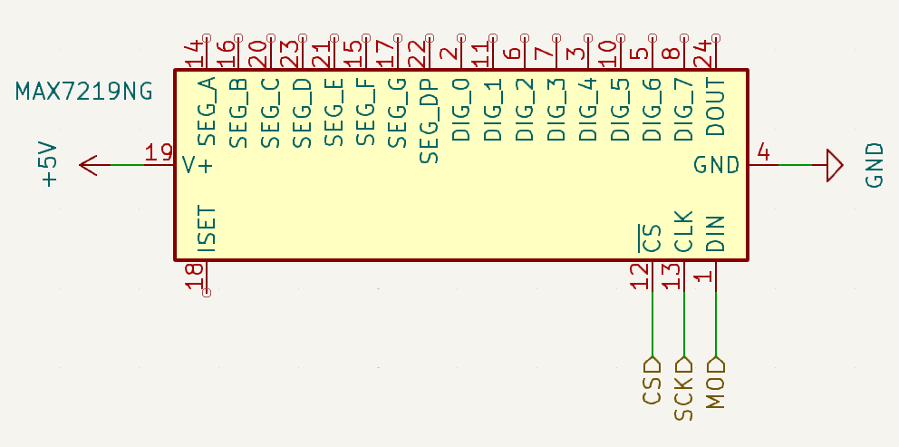
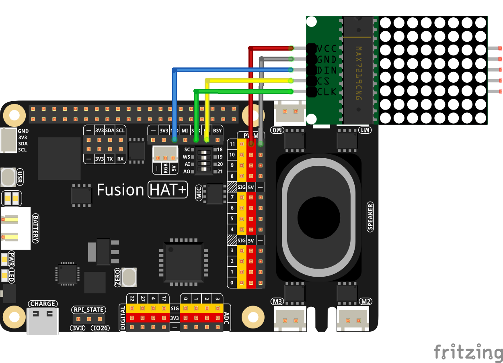

.. note::

    Hello, welcome to the SunFounder Raspberry Pi & Arduino & ESP32 Enthusiasts Community on Facebook! Dive deeper into Raspberry Pi, Arduino, and ESP32 with fellow enthusiasts.

    **Why Join?**

    - **Expert Support**: Solve post-sale issues and technical challenges with help from our community and team.
    - **Learn & Share**: Exchange tips and tutorials to enhance your skills.
    - **Exclusive Previews**: Get early access to new product announcements and sneak peeks.
    - **Special Discounts**: Enjoy exclusive discounts on our newest products.
    - **Festive Promotions and Giveaways**: Take part in giveaways and holiday promotions.

    👉 Ready to explore and create with us? Click [|link_sf_facebook|] and join today!

.. _exp_spi:

SPI (LedMatrix)
=====================

**Introduction**

SPI (Serial Peripheral Interface) is a serial communication interface used between a microcontroller and peripherals, similar to I2C. The SPI protocol requires four signal lines: MOSI, MISO, SCLK, and SS.

An LED dot matrix is a grid of LEDs that can be illuminated to display characters, symbols, or animations. Since the 8×8 LED display does not need to send data out, the MISO pin is not required.

This project demonstrates how to use SPI to control an LED dot matrix for displaying static patterns.

----------------------------------------------

**Circuit Diagram**

The circuit connects the LED dot matrix to the Raspberry Pi using SPI communication. The schematic below provides a clear view of the wiring.

----------------------------------------------

**Wiring Diagram**

Follow these steps to build the circuit:

1. Connect the SPI interface pins (MOSI, SCK, and CS) to the Fusion HAT pins.
2. Ensure proper power supply connections to the matrix.

----------------------------------------------

**Writing the Code**

.. raw:: html

   <run></run>

.. code-block:: python

    from fusion_hat.modules import LedMatrix

    rgb_matrix = LedMatrix(rotate=0)

    #Define a simple pattern (e.g., a smiley face)

    # pattern = [
    #     0b00111100,
    #     0b01000010,
    #     0b10100101,
    #     0b10000001,
    #     0b10100101,
    #     0b10011001,
    #     0b01000010,
    #     0b00111100
    # ]

    pattern = [
        0b01111110,
        0b01000000,
        0b00111100,
        0b00000010,
        0b00000001,
        0b00000001,
        0b01000010,
        0b00111100
    ]

    rgb_matrix.display_pattern(pattern) 

    # To keep the display on, prevent the script from exiting (e.g., with a loop)
    input("Press Enter to exit...")

This script demonstrates how to control an LED matrix using the Fusion Hat library. It initializes the LED matrix and displays a predefined pattern.

Run the script on a compatible device with an attached LED matrix. The matrix will display a defined pattern until the user manually exits the script.

