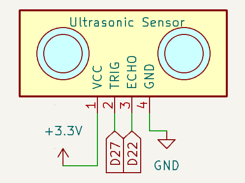
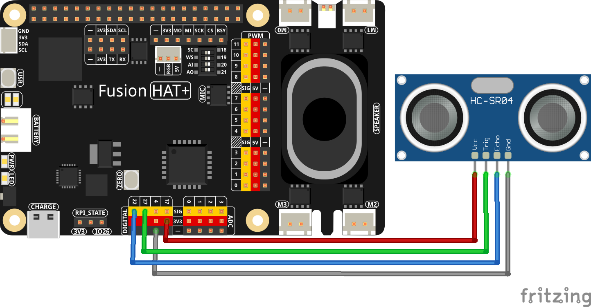

.. note::

    Hello, welcome to the SunFounder Raspberry Pi & Arduino & ESP32 Enthusiasts Community on Facebook! Dive deeper into Raspberry Pi, Arduino, and ESP32 with fellow enthusiasts.

    **Why Join?**

    - **Expert Support**: Solve post-sale issues and technical challenges with help from our community and team.
    - **Learn & Share**: Exchange tips and tutorials to enhance your skills.
    - **Exclusive Previews**: Get early access to new product announcements and sneak peeks.
    - **Special Discounts**: Enjoy exclusive discounts on our newest products.
    - **Festive Promotions and Giveaways**: Take part in giveaways and holiday promotions.

    👉 Ready to explore and create with us? Click [|link_sf_facebook|] and join today!

.. _exp_ultrasonic:

Ultrasonic Sensor Module
==============================

**Introduction**

The ultrasonic sensor module uses ultrasonic waves to measure distances with remarkable accuracy. It emits ultrasonic waves and listens for their echo, calculating the distance based on the time taken for the echo to return. This versatile technology is commonly used in robotics, obstacle detection, and range-finding applications.

----------------------------------------------

**Circuit Diagram**

Below is the schematic diagram for the ultrasonic sensor module:

----------------------------------------------

**Wiring Diagram**

Assemble the circuit as shown in the diagram below:

Ensure the connections are secure, with the Echo pin connected to GPIO 22 and the Trigger pin to GPIO 27 of the Raspberry Pi.

----------------------------------------------

**Code**

Below is the Python code for this project:

.. raw:: html

   <run></run>

.. code-block:: python

   # Import Ultrasonic and Pin class
   from fusion_hat.modules import Ultrasonic
   from fusion_hat.pin import Pin
   from time import sleep

   # Create Ultrasonic object
   sensor = Ultrasonic(Pin(27), Pin(22))

   try:
      # Main loop to continuously measure and report distance
      while True:
         dis = sensor.read() # Measure distance in centimeters
         print('Distance: {:.2f} cm'.format(dis))  # Print the distance with two decimal precision
         sleep(0.3)  # Wait for 0.3 seconds before the next measurement

   except KeyboardInterrupt:
      # Handle KeyboardInterrupt (Ctrl+C) to gracefully exit the loop
      pass

This Python script uses an ultrasonic distance sensor to measure the distance to an object and displays the result on the console. When executed:

1. The sensor, connected to GPIO pins 27 (trigger) and 22 (echo), continuously measures the distance to the nearest object.
2. The distance is calculated in meters and converted to centimeters, then displayed in the format: ``Distance: <value> cm`` with two decimal places of precision.
3. The distance is updated every 0.3 seconds, allowing for near real-time monitoring.
4. The program runs indefinitely until interrupted with ``Ctrl+C``, at which point it exits gracefully.

