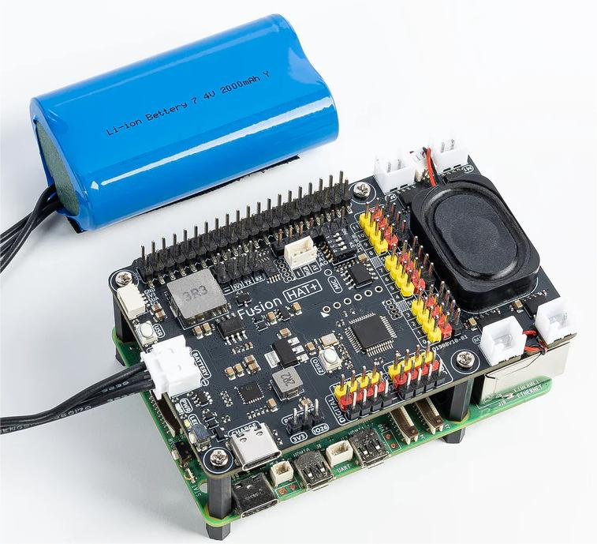
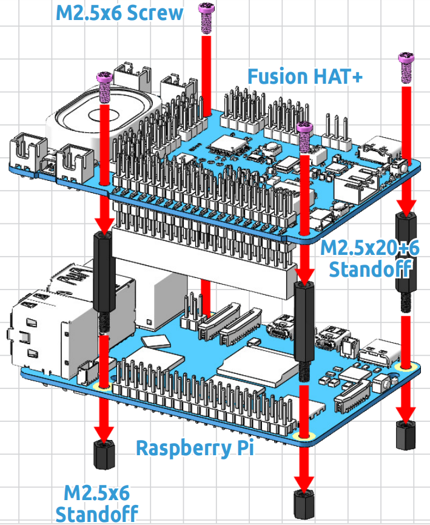
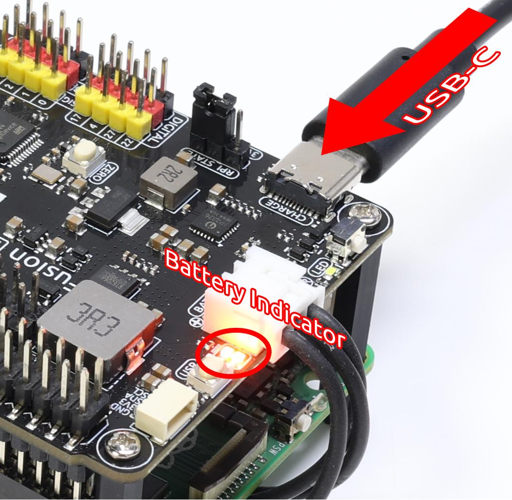
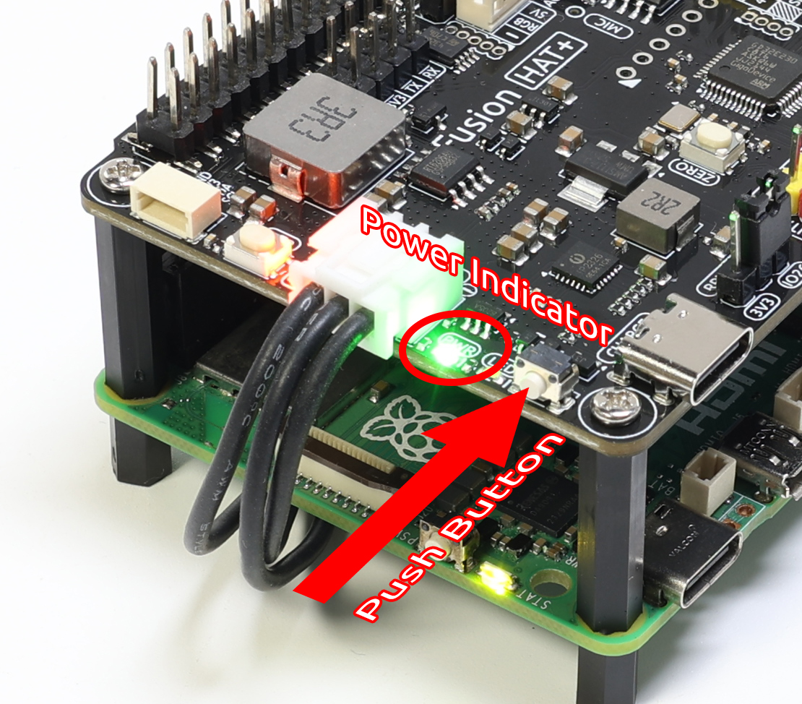

.. note::

    Hello, welcome to the SunFounder Raspberry Pi & Arduino & ESP32 Enthusiasts Community on Facebook! Dive deeper into Raspberry Pi, Arduino, and ESP32 with fellow enthusiasts.

    **Why Join?**

    - **Expert Support**: Solve post-sale issues and technical challenges with help from our community and team.
    - **Learn & Share**: Exchange tips and tutorials to enhance your skills.
    - **Exclusive Previews**: Get early access to new product announcements and sneak peeks.
    - **Special Discounts**: Enjoy exclusive discounts on our newest products.
    - **Festive Promotions and Giveaways**: Take part in giveaways and holiday promotions.

    👉 Ready to explore and create with us? Click [|link_sf_facebook|] and join today!

.. _install_all_modules:

Quick User Guide
================================================================

This guide will help you set up everything quickly.

We'll walk through:

* How to assemble the hardware
* Setting up the shutdown function
* Installing necessary software

Just follow the simple steps - you'll be up and running in no time. Let's begin!

Assembling the Fusion HAT
-----------------------------

Charge
-------------------

Before the first use, it is recommended to fully charge the battery. You can use the included USB Type-C charging cable, or your own USB-C charger.  

* We recommend using a **5V 3A power supply**, such as the official Raspberry Pi 15W adapter.  
* You can also use a **USB-C PD (Power Delivery)** charger or a **QC 2.0 fast charger**.  
* Charging from 0% to full typically takes about **2 hours**.  

The Fusion HAT includes **two battery indicator LEDs**, showing the battery voltage level:  

.. list-table::
   :header-rows: 1
   :widths: 40 40

   * - LED Status
     - Battery Voltage
   * - 2 LEDs ON
     - > 7.4V
   * - 1 LED ON
     - < 7.4V
   * - Both LEDs OFF
     - < 6.5V

When charging, one of the LEDs will blink to indicate charging progress:  

.. list-table::
   :header-rows: 1
   :widths: 40 40

   * - LED Status
     - Battery Voltage
   * - 1 LED ON, 1 LED Blinking
     - > 7.4V
   * - Only 1 LED Blinking
     - < 7.4V

After fully charged:

* **If the Fusion HAT is ON**, both LEDs will remain lit.  
* **If the Fusion HAT is OFF**, both LEDs will turn off.  

.. note::

   For extended programming or debugging sessions, you can keep the Fusion HAT powered  
   by connecting the USB-C cable, which will charge the battery and run the Fusion HAT at the same time.

Power ON
----------------------

When the battery has sufficient charge, press the **power button** on the Fusion HAT briefly. 

* The **PWR LED** will turn on.  
* The **battery LEDs** will also light up.  
* The Raspberry Pi will power on automatically.  

.. _shutdown_behavior:

Configure Shutdown Behavior
----------------------------

The Fusion HAT relies on the Raspberry Pi shutdown signal to manage the full system power.  
Therefore, you need to configure shutdown behavior properly.

**For Raspberry Pi 5 and 4B**

These models support complete power-off after shutdown. The Fusion HAT monitors the 3.3V line to detect the Pi’s power state.

1. Place the jumper on **RPI State → Pi3V3**.

   .. image:: img/state_3v3.jpg
      :width: 400

2. Open the EEPROM configuration tool:

   .. code-block::

      sudo raspi-config

3. Navigate to **Advanced Options → A12 Shutdown Behaviour**.

   .. image:: img/shutdown_behaviour.png

4. Select **B1 Full Power Off**.

   .. image:: img/run_power_off.png

5. Save the changes. You will be prompted to reboot for the new settings to take effect.

**For Raspberry Pi Zero 2W, 3B, 3B+**

These models do **not** support full power-off using 3.3V. Instead, GPIO26 must be configured as a shutdown state indicator.

1. Place the jumper on **RPI_STATE → IO26**.

   .. image:: img/state_io26.jpg
      :width: 400

2. Edit the ``/boot/firmware/config.txt`` file:

   .. code-block::

      sudo nano /boot/firmware/config.txt

3. Add the following line at the end to set GPIO26 as low on shutdown and high on power-up:

   .. code-block::

      dtoverlay=gpio-poweroff,gpio_pin=26,active_low=1

4. Reboot to apply changes:

   .. code-block::

      sudo reboot

.. _install_fusion_hat:

Install the ``fusion-hat`` Module
------------------------------------------

The ``fusion-hat`` package provides the necessary libraries and tools for operating the Fusion HAT hardware.

Run the following installation command:

.. code-block:: bash

   curl -sSL https://raw.githubusercontent.com/sunfounder/sunfounder-installer-scripts/main/install-fusion-hat.sh | sudo bash

After installation completes, reboot the Raspberry Pi. Then execute the audio setup script:

.. code-block:: bash

   sudo /opt/setup_fusion_hat_audio.sh

This completes the software installation process for the Fusion HAT.

Safe Shutdown
--------------

After the above setup, you can safely shut down your Fusion HAT using the onboard power button.  
This step is only to show you how to shut down when needed—you don’t have to power off now and can continue to the next step.

**Soft Shutdown**

* Press and hold the power button for **2 seconds**.  
* The two power LEDs will flash rapidly.  
* Release the button → Fusion HAT triggers Raspberry Pi shutdown.  
* Once the Pi finishes shutting down, Fusion HAT cuts power automatically.  
* This protects your SD card and files.

**Hard Shutdown**

* If the system freezes or crashes, press and hold the power button for **5+ seconds**.  
* Fusion HAT will force power-off.  
* ⚠️ Warning: This may corrupt the SD card or system files. Use only when necessary.
